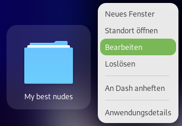
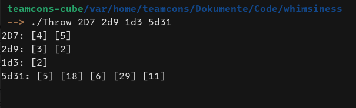
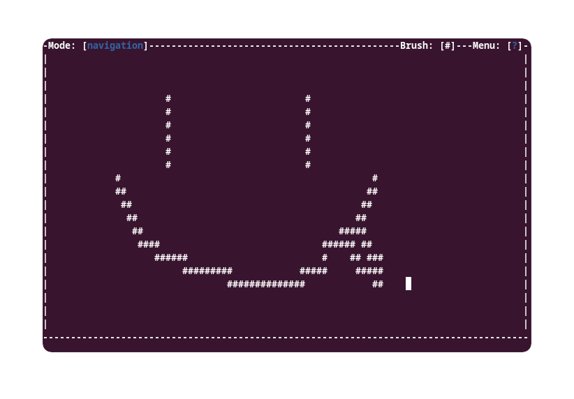

# whimsiness
Funky bash scripts ayo

## Nautilus scripts/
**pin**
- put it in /.local/share/nautilus/scripts
- now from a right click you can transform any file or folder as menu entry
- and pin it on your dock as if it were an app :)
- include actions: delete the entry, edit it, open the locasion of the file or folder
- Theoretically desktop agnostic

## random/
**Throw**
- Throw as much dices as you want, whichever dices you want, idk im not ur mom
- Has an option for nonfancy output, for scripts
- I used that while DMing, for secret intuition/perception PC throws, environmental stuff, NPCs...

**Asciirage.sh**
- Interactive script with interactive menus
- Features colors, colors are rad
- You can change bruch, erase, navigate
- Controlled with arrows by keyboard
- Can save and load drawings
- Its all bash

